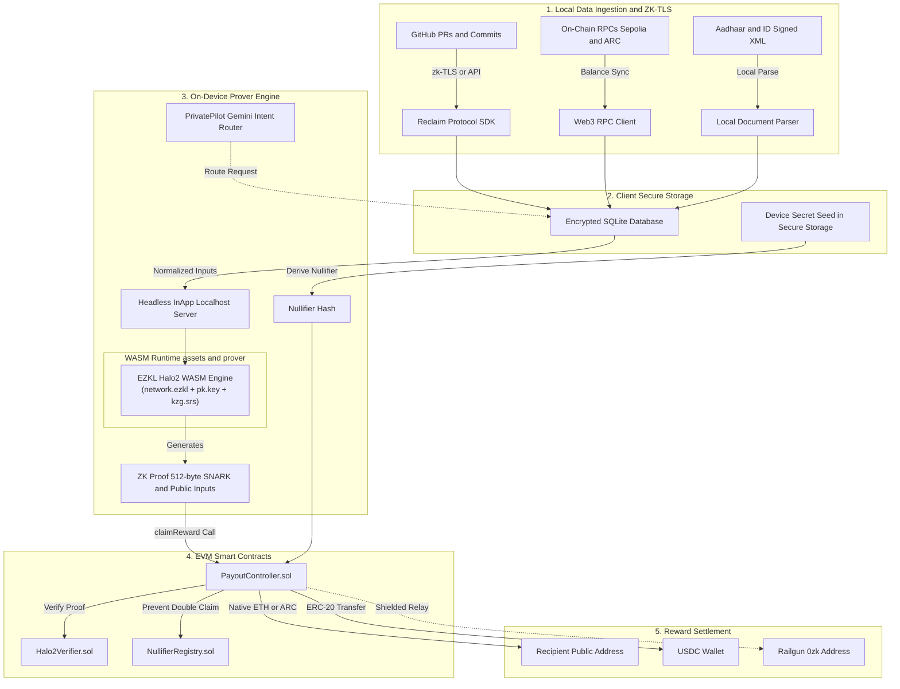
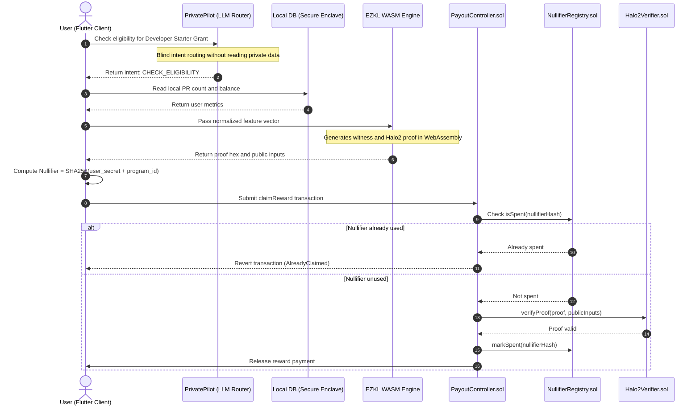

# Veil

Privacy-preserving conditional payments and developer grants powered by on-device zkML and ZK-TLS.

---

## Overview

Traditional verification for grants, developer rewards, and conditional payouts requires users to upload raw financial records, tax documents, or privileged API tokens to central servers.

Veil flips this flow: **evaluation runs locally on the user's device.**
1. Data sources (GitHub contributions, on-chain balances, signed documents) are fetched into a local encrypted store on the device.
2. An on-device machine learning model or rule circuit evaluates qualification criteria.
3. The app produces a zero-knowledge proof (via EZKL / Halo2 WASM) along with a deterministic nullifier.
4. Smart contracts on Ethereum Sepolia and Arc Testnet verify the proof on-chain and trigger payouts (ETH, USDC, ARC) without ever seeing the private inputs.

---

## Architecture

The system is split into five layers across the client device, the proving runtime, and on-chain settlement contracts.



---

## Transaction & Verification Flow



---

## Technical Components

### 1. PrivatePilot (Blind Intent Routing)
PrivatePilot uses Google Gemini (`gemini-3.5-flash`) as an intent parser. It is intentionally sandboxed as a **blind router**: user data (balances, PR count, identity) is never sent to the LLM. Instead, the prompt instructs the model to translate user natural language queries into local application commands (`CHECK_ELIGIBILITY`, `FIND_ELIGIBLE_PROGRAMS`, `GENERATE_PROOF`), which the Flutter client resolves strictly on-device.

### 2. zkML Pipeline (EZKL & Halo2)
* **Model**: Logistic regression classifier trained in PyTorch (`ml_zk/1_train_export.py`) on 4 normalized features (monthly spending, average transaction size, transaction frequency, monthly income).
* **Export**: ONNX Opset 14.
* **Circuit Setup**: Calibrated using EZKL with KZG polynomial commitments over the BN254 curve (`ml_zk/2_ezkl_pipeline.py`).
* **Mobile Runtime**: Compiled to WASM (`@ezkljs/engine`) and bundled inside `assets/prover`. Proofs are generated inside a local headless WebView instance without hitting external servers.
* **On-Chain Verifier**: Auto-generated `Halo2Verifier.sol` deployed on EVM testnets.

### 3. ZK-TLS Ingestion (Reclaim Protocol)
For Web2 identity and activity verification (e.g. GitHub pull requests), Veil integrates Reclaim Protocol's SDK to generate zero-knowledge TLS proofs of authenticated HTTPS sessions, keeping credentials and session tokens private.

### 4. Double-Claim Prevention (Nullifier Architecture)
To prevent users from draining grant pools with the same qualifying proof, Veil uses a deterministic nullifier scheme:
```
nullifier = SHA256(user_secret + program_id)
```
* `user_secret` is generated locally on first app launch and stored in `flutter_secure_storage`.
* The smart contract records spent nullifiers in `NullifierRegistry.sol`.
* Because `user_secret` remains private and nullifiers are program-specific, claims cannot be linked across different programs by third-party observers.

---

## Repository Structure

```
veil/
├── contracts/                  # Solidity smart contracts & Foundry suite
│   ├── src/
│   │   ├── Halo2Verifier.sol   # Halo2 SNARK verifier contract
│   │   ├── NullifierRegistry.sol # State registry tracking spent nullifiers
│   │   ├── PayoutController.sol  # Reward deposits and proof verification entrypoint
│   │   ├── MockUSDC.sol        # Testnet ERC-20 token for grant payouts
│   │   └── SimulatedVerifier.sol # Mock verifier for testing
│   ├── script/
│   │   ├── Deploy.s.sol        # Sepolia deployment script
│   │   ├── DeployArc.s.sol     # Arc Testnet deployment script
│   │   └── AddPrograms.s.sol   # Program setup script
│   └── foundry.toml
│
├── ml_zk/                      # PyTorch training & EZKL zkML toolchain
│   ├── 1_train_export.py       # Model training & ONNX export
│   ├── 2_ezkl_pipeline.py      # Circuit calibration, SRS & verifier export
│   ├── run_pipeline.py         # Pipeline execution runner
│   ├── eligibility_model.onnx  # Exported ONNX model
│   ├── network.ezkl            # Compiled Halo2 circuit
│   └── settings.json           # Calibrated circuit settings
│
├── js_prover/                  # In-app WASM prover bridge
│   ├── src/index.js            # EZKL engine & Reclaim SDK bridge
│   ├── webpack.config.js       # Production bundler for Flutter assets
│   └── package.json
│
└── veil/                       # Flutter mobile client
    ├── lib/
    │   ├── models/             # Data models (Program, ClaimResult)
    │   ├── screens/            # UI views (Dashboard, PrivatePilot, DataSources, GenerateProof)
    │   ├── services/           # Services (BlockchainService, ProofService, LlmService, DatabaseService)
    │   └── theme.dart          # UI styling
    └── assets/prover/          # Bundled WASM binaries & circuit keys
        ├── b4bfe42dbcf8fc6c89ab.wasm # EZKL WASM engine
        ├── prover.bundle.js    # Bundled bridge
        ├── network.ezkl        # Circuit bytecode
        ├── pk.key              # KZG proving key
        └── kzg.srs             # Structured reference string
```

---

## Deployed Contracts

| Network | Contract | Address |
| :--- | :--- | :--- |
| **Ethereum Sepolia** | `PayoutController` | `0xBb06731dfD073843c827794F6049cEA28E39A238` |
| **Ethereum Sepolia** | `Halo2Verifier` | `0x369005861e0E5E19229ED6D234C60750F159e241` |
| **Ethereum Sepolia** | `NullifierRegistry`| `0x523030E89291C95cD8F7743f4C4B1433ff5383a6` |
| **Arc Testnet** | `PayoutController` | `0xB012655ba9cb837B93B70Adea3BCDfE488e11571` |

---

## Local Setup

### Requirements
- Flutter SDK (3.22+)
- Foundry (`forge`, `cast`)
- Python 3.10+
- Node.js 18+

---

### 1. Mobile App

```bash
cd veil

# Configure environment variables
cp .env.example .env
# Set GEMINI_API_KEY in .env

# Install dependencies
flutter pub get

# Run on emulator or physical device
flutter run
```

---

### 2. Smart Contracts

```bash
cd contracts

# Build contracts
forge build

# Run test suite
forge test

# Deploy to Sepolia
forge script script/Deploy.s.sol \
  --rpc-url https://ethereum-sepolia-rpc.publicnode.com \
  --private-key <PRIVATE_KEY> \
  --broadcast -vvvv
```

---

### 3. zkML Pipeline

```bash
cd ml_zk

# Create virtualenv
python3 -m venv .venv
source .venv/bin/activate  # On Windows: .venv\Scripts\activate

# Install dependencies
pip install -r requirements.txt
pip install solc-select
solc-select install 0.8.20 && solc-select use 0.8.20

# Run training and circuit generation
python run_pipeline.py
```

---

### 4. WASM Prover Bundle

```bash
cd js_prover

npm install
npm run build
```

---

## Privacy & Security

- **Local Storage**: Private data (balances, PR counts, identity attributes) is stored in SQLite and protected device storage. No raw metrics are sent over the network.
- **Circuit Correctness**: Halo2 SNARK proofs are verified mathematically by `Halo2Verifier.sol` before any payout is dispatched.
- **Nullifier Guarantees**: Prevents replay attacks and double-spending while preserving anonymity across programs.

